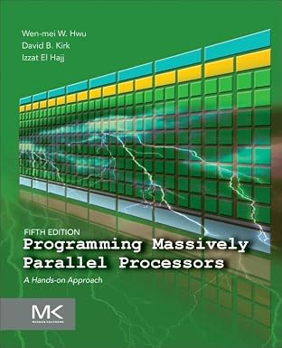

# PMPP CUDA Samples



Unofficial, hand-written CUDA C++ code samples for every code-bearing
chapter (2–23) of *Programming Massively Parallel Processors: A
Hands-on Approach*, 5th Edition (Hwu, Kirk, El Hajj). The book does not
ship an official repository; this project builds one, organized to
mirror the book's own structure.

## Prerequisites

- CUDA Toolkit 12.6+ (`nvcc` on `PATH`)
- GNU Make
- An NVIDIA GPU, compute capability 7.5+ (sm_75). Two chapters (6 and
  15) have one sample each that requires compute capability 8.0+
  (Ampere or newer) — noted in their READMEs.

## Layout

- `part1-fundamental-concepts/` — Ch 2–6
- `part2-parallel-patterns/` — Ch 7–15
- `part3-advanced-patterns-and-applications/` — Ch 16–23
- `common/cuda_utils.h` — shared error-checking, timing, and
  float-comparison helpers used by every sample

## Build & run

Each chapter folder is independent:

```sh
make -C part2-parallel-patterns/ch07-convolution run
```

builds every sample in that chapter and runs it, printing PASS/FAIL and
timing for each.

## Scope

Samples implement the kernels, host code, and algorithms the book's
prose and figures actually present, chapter by chapter. End-of-chapter
exercises are not implemented. Appendices A–C and Chapter 1/24 are out
of scope (see the design spec in `docs/superpowers/specs/`).
