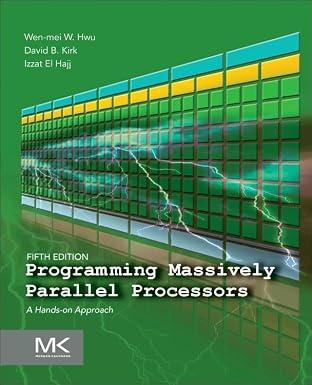

# PMPP CUDA Samples



Unofficial, hand-written CUDA C++ code samples for every code-bearing
chapter (2–23) of *Programming Massively Parallel Processors: A
Hands-on Approach*, 5th Edition (Hwu, Kirk, El Hajj). The book does not
ship an official repository; this project builds one, organized to
mirror the book's own structure.

## Prerequisites

- CUDA Toolkit 12.6+ (`nvcc` on `PATH`)
- GNU Make
- An NVIDIA GPU, compute capability 7.5+ (sm_75). Two chapters (6 and
  15) have one sample each that requires compute capability 8.0+
  (Ampere or newer) — noted in their READMEs.

## Layout

- `part1-fundamental-concepts/` — Ch 2–6
- `part2-parallel-patterns/` — Ch 7–15
- `part3-advanced-patterns-and-applications/` — Ch 16–23
- `common/cuda_utils.h` — shared error-checking, timing, and
  float-comparison helpers used by every sample

## Chapter index

| Ch | Directory | Topic |
|----|-----------|-------|
| 2 | `part1-fundamental-concepts/ch02-heterogeneous-data-parallel-computing` | Vector addition |
| 3 | `part1-fundamental-concepts/ch03-multidimensional-grids-and-data` | Grayscale, blur, naive matmul |
| 4 | `part1-fundamental-concepts/ch04-compute-architecture-and-scheduling` | Control divergence, device query |
| 5 | `part1-fundamental-concepts/ch05-memory-architecture-and-data-locality` | Tiled matrix multiplication |
| 6 | `part1-fundamental-concepts/ch06-performance-considerations` | Performance-tuning techniques |
| 7 | `part2-parallel-patterns/ch07-convolution` | 1D/2D convolution |
| 8 | `part2-parallel-patterns/ch08-stencil-computation` | Stencil computation |
| 9 | `part2-parallel-patterns/ch09-histogram` | Histogram (atomics, privatization) |
| 10 | `part2-parallel-patterns/ch10-reduction` | Parallel reduction |
| 11 | `part2-parallel-patterns/ch11-scan` | Parallel scan (prefix sum) |
| 12 | `part2-parallel-patterns/ch12-filter` | Stream compaction / filter |
| 13 | `part2-parallel-patterns/ch13-merge` | Parallel merge |
| 14 | `part2-parallel-patterns/ch14-sorting` | Parallel sorting |
| 15 | `part2-parallel-patterns/ch15-advanced-matmul-optimizations` | Advanced matmul optimizations |
| 16 | `part3-advanced-patterns-and-applications/ch16-dynamic-programming-and-wavefront-parallelism` | Dynamic programming, wavefront parallelism |
| 17 | `part3-advanced-patterns-and-applications/ch17-sparse-matrix-computation` | Sparse matrix computation (SpMV) |
| 18 | `part3-advanced-patterns-and-applications/ch18-graph-traversal` | Graph traversal (BFS) |
| 19 | `part3-advanced-patterns-and-applications/ch19-convolutional-neural-networks` | Convolutional neural network layers |
| 20 | `part3-advanced-patterns-and-applications/ch20-large-language-models` | Attention / LLM kernels |
| 21 | `part3-advanced-patterns-and-applications/ch21-electrostatic-potential-map` | Electrostatic potential map |
| 22 | `part3-advanced-patterns-and-applications/ch22-algorithm-selection-and-problem-decomposition` | Algorithm selection, problem decomposition |
| 23 | `part3-advanced-patterns-and-applications/ch23-multi-gpu-programming` | Multi-GPU programming (MPI/NCCL/NVSHMEM) |

## Build & run

Each chapter folder is independent:

```sh
make -C part2-parallel-patterns/ch07-convolution run
```

builds every sample in that chapter and runs it, printing PASS/FAIL and
timing for each.

## Build modes

Every chapter Makefile supports a `DEBUG` toggle. `DEBUG=1` is the
default — `make` / `make run` with no arguments — and builds with
`-O0 -g -G`, producing a binary that is fully steppable with `cuda-gdb`
and correctness-focused rather than fast. Pass `DEBUG=0` (e.g.
`make DEBUG=0 run`) for an optimized, symbol-free `-O2` build. Where a
chapter's own README quotes specific timing numbers, they were measured
under the build mode noted in that chapter's README (most that publish a
timing comparison used `DEBUG=0`, since `-G` skews relative timings) —
check the chapter's README rather than assuming a single repo-wide
convention, and re-measure with `make DEBUG=0 run` if you need to
reproduce a published number yourself.

Chapter 23's `02`-`05` (MPI, MPI+overlap, NCCL, and NVSHMEM multi-GPU
stencil samples, respectively) are written in full but are not buildable
on a machine without the corresponding MPI/NCCL/NVSHMEM development
packages installed — see `part3-advanced-patterns-and-applications/ch23-multi-gpu-programming/README.md`
for details. Every other sample in the repo builds and runs with no
extra dependencies beyond the CUDA Toolkit.

## Scope

Samples implement the kernels, host code, and algorithms the book's
prose and figures actually present, chapter by chapter. End-of-chapter
exercises are not implemented. Appendices A–C and Chapter 1/24 are out
of scope (see the design spec in `docs/superpowers/specs/`).

## October 2026 walkthrough

Every chapter (3–23) was re-validated against the book text one at a
time — reading the actual chapter, cross-checking every sample and every
number a chapter's README states against it, building and running each
sample (and `compute-sanitizer` where a chapter already used it) — rather
than assuming prior work was correct. Each chapter's own README has the
full detail; this table is a pointer to what changed, not a substitute
for it.

| Ch | Outcome |
|----|---------|
| 3 | Fixed misleading timings: no warm-up launch meant a fresh build's first run measured one-time JIT-compile cost, not kernel time (~30–50x inflated). Added warm-up to all three samples. |
| 4 | Added two samples: loop-divergence cost (Fig. 4.10) measured against uniform-trip-count baselines, and the `cudaOccupancyMaxActiveBlocksPerMultiprocessor` API (named in §4.7, previously unused by any sample). |
| 5 | Added two samples: the runtime-configurable `extern __shared__` technique (Fig. 5.14), and a shared-memory-driven occupancy sweep (§5.6, this chapter's counterpart to Ch. 4's register-driven one). |
| 6 | Added a corner-turning sample (§6.1/§6.4, Fig. 6.4) — the book's own coalescing + bank-conflict example, previously unimplemented. |
| 7 | Fixed a factor-of-2 error in the README's transcription of the tiled kernel's arithmetic-intensity formula. No code changes. |
| 8 | Reviewed — samples, figures, and numbers all check out. No changes. |
| 9 | Added two head-to-head samples the book itself sets up but neither had been measured against the other: global- vs. shared-memory privatization (Fig. 9.9 vs. 9.10), and contiguous- vs. interleaved-partitioning coarsening (Fig. 9.12 vs. 9.14). |
| 10 | Fixed an omitted book-stated number (the convergent kernel's memory-request count) in the README. No code changes. |
| 11 | Reviewed — every derived formula and figure checks out. No changes. |
| 12 | Added a duplicate-key-removal sample (§12.8's named special case of stable filter) and a missing README section. |
| 13 | Explained a counterintuitive measured result (circular-buffer tiling measuring slower than plain tiling) that the README reported but didn't account for. No code changes. |
| 14 | Added a 2-bit radix sort sample (§14.7, Figs. 14.10–14.12) and corrected a README note that mischaracterized this section as out of scope. |
| 15 | Added the README's missing Results section, which surfaced (and explained) another counterintuitive measured result. No code changes. |
| 16 | Added a missing README section summarizing the chapter's conceptual sections. No code changes. |
| 17 | Same as Ch. 16 — added the missing conceptual-sections summary. No code changes. |
| 18 | Added a push-vs-pull BFS sample (Fig. 18.6 vs. 18.8) — another book-set-up comparison that had never been measured. |
| 19 | Added a memory-access/bank-conflict analysis for Fig. 19.11 (answering an exercise the book poses as analysis, not code) and a missing README section. No code changes. |
| 20 | Confirmed a discrepancy between the book's prose and its own code (Fig. 20.14) is a genuine error in the published text, not a `pdftotext` artifact as previously hedged — verified by reading the actual rendered page. Answered two more analysis exercises. No code changes. |
| 21 | Added the book's own operation-count numbers (previously uncaptured) and the README's missing Results section, which surfaced and explained a genuine counterintuitive result (coarsening measuring slower at this grid size). No code changes. |
| 22 | Reviewed — this chapter is a retrospective with one implementable section, already correctly scoped and implemented. No changes. |
| 23 | Real NCCL/NVSHMEM headers turned out to be present on this machine (as pip dependencies of unrelated environments); recompiled the NCCL/NVSHMEM samples against them, confirming every API signature the README had flagged as needing a reviewer's double-check. Found and fixed two trivial, functionally-harmless deviations from the book's exact listings. MPI itself remains unavailable, so those samples are compile-verified, not run-verified. |
